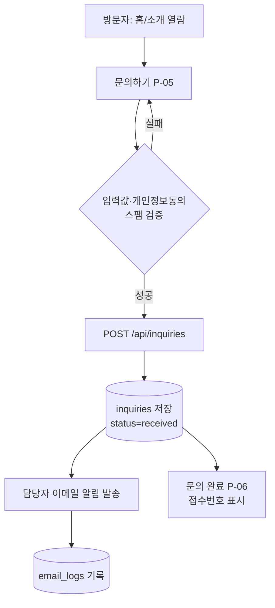
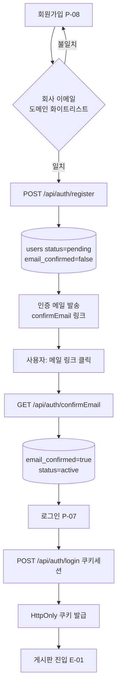
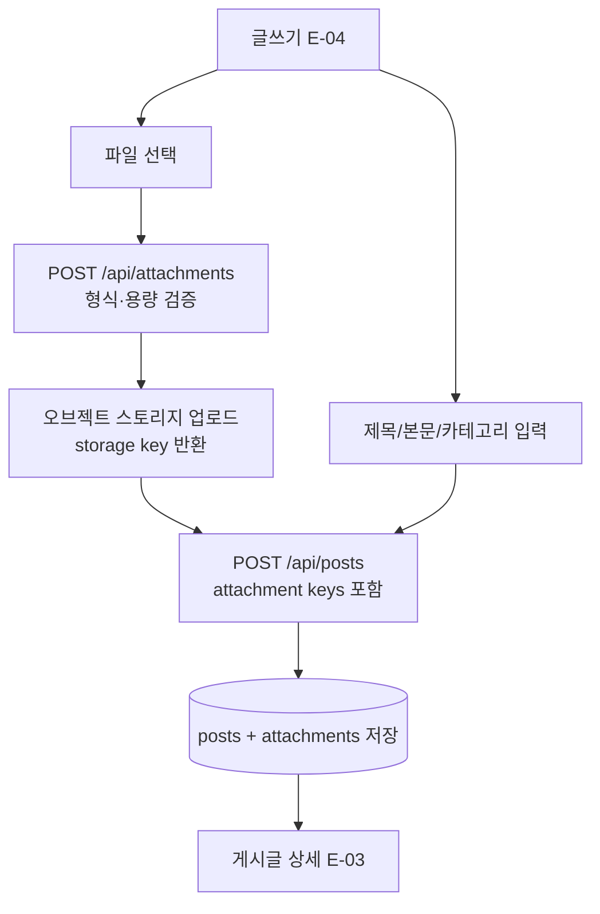
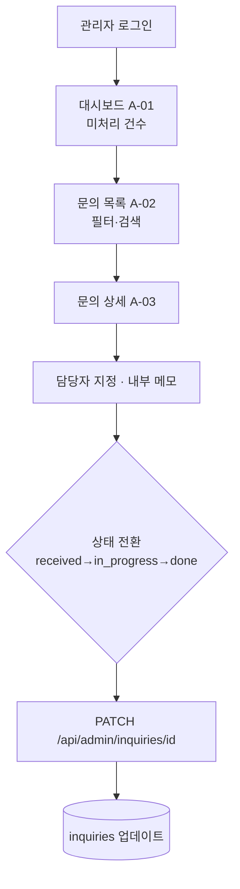
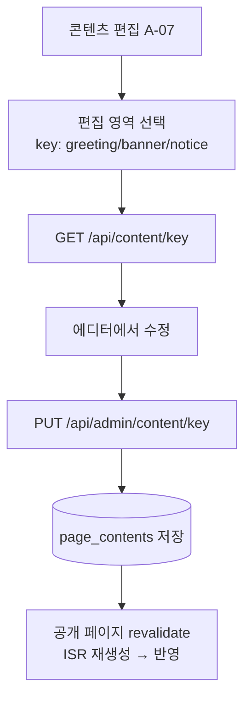
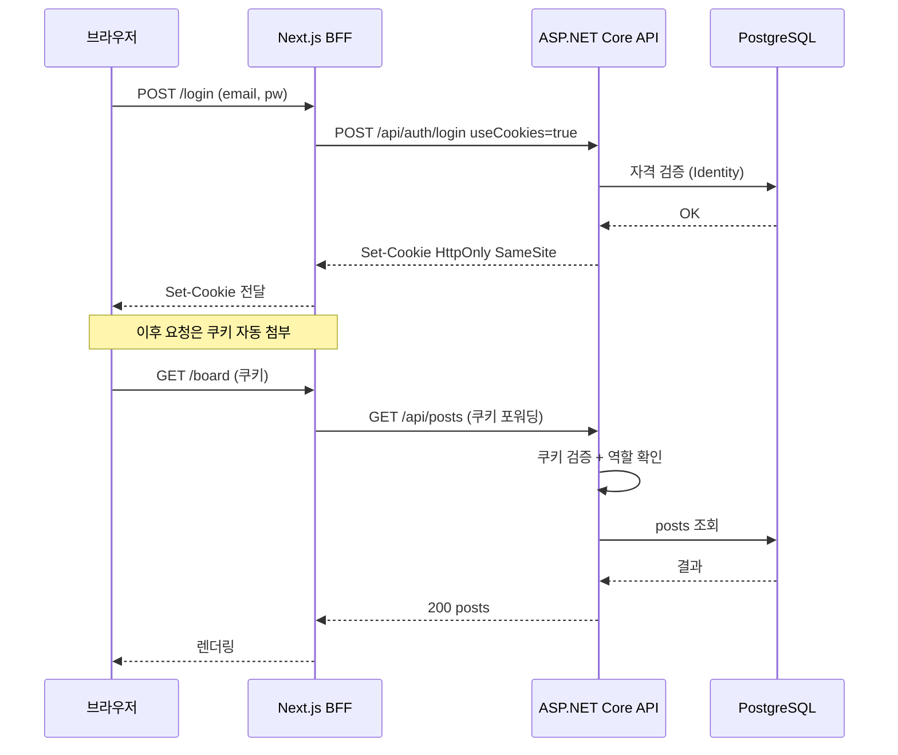

# 시스템 설계서 (Design Document)

- 문서 버전: v1.0
- 작성일: 2026-07-16
- 상위 문서: [PRD.md](./PRD.md) — 요구사항의 source of truth
- 범위: 사이트 구조(IA) · 유저플로우 · 기술 스택/아키텍처 상세 설계

---

## 1. 설계 원칙

| 원칙 | 내용 |
|---|---|
| 3영역 분리 | 공개(Public) / 직원(Employee) / 관리자(Admin)를 라우트·권한·렌더링 전략에서 명확히 분리 |
| 프론트/백 분리 + BFF | Next.js가 UI와 BFF(프록시)를 담당, ASP.NET Core API가 도메인 로직 담당 |
| 쿠키 기반 인증 | HttpOnly·SameSite 쿠키. 토큰을 JS에 노출하지 않음(XSS 안전) |
| 서버 권한이 최종 | 프론트 라우트 가드는 UX용, **실제 접근제어는 API의 `[Authorize]`가 강제** |
| SEO 우선(공개), 인터랙션 우선(내부) | 공개 페이지는 SSG/ISR, 게시판·관리자는 로그인 후 CSR/SSR 혼합 |
| 규모에 맞춘 단순함 | 과설계 지양. 필요 시 레이어를 나누되 초기에는 실용적 구조 유지 |

---

## 2. 사이트 구조 (Information Architecture)

### 2.1 네비게이션 트리

```
회사 홈페이지
├─ 공개(Public) ─ 상단 GNB
│  ├─ 홈 (/)
│  ├─ 회사소개 (/about)
│  ├─ 사업분야 (/services)
│  ├─ 오시는 길 (/location)
│  └─ 문의하기 (/contact)
│     └─ 문의 완료 (/contact/complete)
├─ 계정(Auth)
│  ├─ 로그인 (/login)
│  ├─ 회원가입 (/register)
│  ├─ 이메일 인증 결과 (/verify-email)
│  └─ 비밀번호 재설정 (/forgot-password, /reset-password)
├─ 사내 게시판(Employee) ─ 로그인 후 노출
│  ├─ 게시판 홈 (/board)
│  ├─ 카테고리별 목록 (/board/[category])
│  ├─ 게시글 상세 (/board/[category]/[postId])
│  ├─ 글쓰기/수정 (/board/new, /board/[category]/[postId]/edit)
│  └─ 내 프로필 (/me)
└─ 관리자(Admin) ─ admin 역할만
   ├─ 대시보드 (/admin)
   ├─ 문의 관리 (/admin/inquiries, /admin/inquiries/[id])
   ├─ 회원 관리 (/admin/members)
   ├─ 카테고리 관리 (/admin/categories)
   ├─ 게시글·댓글 관리 (/admin/posts)
   └─ 콘텐츠 편집 (/admin/content)
```

### 2.2 Next.js 라우트 맵 (프론트엔드)

App Router **라우트 그룹**으로 3영역을 분리하고, 각 그룹의 `layout.tsx`에서 공통 셸/가드를 적용한다. 렌더링 전략은 SEO·인터랙션 요구에 맞춰 지정한다.

| 경로 | 화면 ID | 라우트 그룹 | 접근 | 렌더링 |
|---|---|---|---|---|
| `/` | P-01 | (marketing) | 공개 | SSG + ISR |
| `/about` | P-02 | (marketing) | 공개 | SSG (편집영역은 fetch) |
| `/services` | P-03 | (marketing) | 공개 | SSG |
| `/location` | P-04 | (marketing) | 공개 | SSG |
| `/contact` | P-05 | (marketing) | 공개 | SSR (폼) |
| `/contact/complete` | P-06 | (marketing) | 공개 | CSR |
| `/login` | P-07 | (auth) | 공개 | CSR |
| `/register` | P-08 | (auth) | 공개 | CSR |
| `/verify-email` | P-09 | (auth) | 공개 | SSR (링크 파라미터 처리) |
| `/forgot-password`, `/reset-password` | P-10 | (auth) | 공개 | CSR |
| `/board` | E-01 | (board) | 직원 | SSR/CSR |
| `/board/[category]` | E-02 | (board) | 직원 | SSR (목록·페이징) |
| `/board/[category]/[postId]` | E-03 | (board) | 직원 | SSR |
| `/board/new`, `/board/[category]/[postId]/edit` | E-04 | (board) | 직원 | CSR (에디터) |
| `/me` | E-05 | (board) | 직원 | CSR |
| `/admin` | A-01 | (admin) | 관리자 | CSR |
| `/admin/inquiries`, `/admin/inquiries/[id]` | A-02·A-03 | (admin) | 관리자 | CSR |
| `/admin/members` | A-04 | (admin) | 관리자 | CSR |
| `/admin/categories` | A-05 | (admin) | 관리자 | CSR |
| `/admin/posts` | A-06 | (admin) | 관리자 | CSR |
| `/admin/content` | A-07 | (admin) | 관리자 | CSR |
| `/api/[...path]` | — | BFF | — | Route Handler (프록시) |

> **BFF 프록시:** 브라우저의 모든 API 호출은 Next.js의 `/api/*` Route Handler를 거쳐 ASP.NET Core API로 전달되며, 이때 인증 쿠키를 함께 포워딩한다. `proxy.ts`(미들웨어)에서 `(board)`·`(admin)` 경로의 인증/역할을 1차 확인한다.

### 2.3 ASP.NET Core API 엔드포인트 맵 (백엔드)

기준 프리픽스 `/api`. 인증은 `MapIdentityApi<ApplicationUser>()`를 `/api/auth` 그룹에 매핑.

| 메서드 · 경로 | 기능 | 권한 | 비고 |
|---|---|---|---|
| POST `/api/auth/register` | 회원가입 | 공개 | Identity + **도메인 화이트리스트 검증** |
| POST `/api/auth/login` | 로그인(쿠키 세션) | 공개 | `useCookies=true` |
| POST `/api/auth/logout` | 로그아웃 | 직원 | **커스텀**(`SignInManager.SignOutAsync`) |
| GET `/api/auth/confirmEmail` | 이메일 인증 | 공개 | Identity |
| POST `/api/auth/resendConfirmationEmail` | 인증메일 재발송 | 공개 | Identity |
| POST `/api/auth/forgotPassword` / `resetPassword` | 비밀번호 재설정 | 공개 | Identity |
| GET `/api/auth/me` | 현재 사용자(역할·상태) | 직원 | 커스텀/`manage/info` |
| POST `/api/inquiries` | 문의 제출 | 공개 | Rate limit + 스팸 방지 |
| GET `/api/admin/inquiries` | 문의 목록/검색 | 관리자 | 상태·기간·키워드 필터 |
| GET `/api/admin/inquiries/{id}` | 문의 상세 | 관리자 | |
| PATCH `/api/admin/inquiries/{id}` | 상태/담당자/메모 | 관리자 | |
| GET `/api/categories` | 카테고리 목록 | 직원 | |
| GET `/api/posts` | 게시글 목록 | 직원 | `?category=&page=&q=` |
| GET `/api/posts/{id}` | 게시글 상세 | 직원 | 조회수 증가 |
| POST `/api/posts` | 게시글 작성 | 직원 | 첨부 key 포함 |
| PUT/DELETE `/api/posts/{id}` | 수정/삭제 | 직원(본인)·관리자 | 소유권 검사 |
| POST `/api/posts/{id}/comments` | 댓글 작성 | 직원 | |
| DELETE `/api/comments/{id}` | 댓글 삭제 | 직원(본인)·관리자 | |
| POST `/api/attachments` | 파일 업로드 | 직원 | 형식·용량 검증 → 스토리지 |
| PATCH `/api/admin/posts/{id}/pin` | 공지 고정 | 관리자 | |
| POST/PUT/DELETE `/api/admin/categories` | 카테고리 관리 | 관리자 | |
| DELETE `/api/admin/posts/{id}`, `/api/admin/comments/{id}` | 모더레이션 삭제 | 관리자 | |
| GET `/api/admin/members`, PATCH `/api/admin/members/{id}` | 회원 관리 | 관리자 | 역할·상태 변경 |
| GET `/api/content/{key}` | 편집 콘텐츠 조회 | 공개 | CMS 읽기 |
| PUT `/api/admin/content/{key}` | 편집 콘텐츠 수정 | 관리자 | CMS 쓰기 |

---

## 3. 유저플로우 (User Flows)

### 3.1 방문자 — 문의 접수 (F-INQ)



### 3.2 직원 — 가입 → 이메일 인증 → 로그인 (F-AUTH)



> **선택(F-AUTH-06):** 관리자 승인제를 켜면 `confirmEmail` 이후에도 `status=pending`을 유지하고, 관리자가 A-04에서 `active`로 전환해야 로그인 가능하게 분기한다.

### 3.3 직원 — 게시글 작성(첨부 포함) (F-BRD)



### 3.4 관리자 — 문의 처리 (F-INQ 관리)



### 3.5 관리자 — 콘텐츠 편집 (하이브리드 CMS)



### 3.6 인증 시퀀스 — BFF 쿠키 흐름 (핵심)



---

## 4. 기술 스택 및 아키텍처 상세

### 4.1 전체 구성도

```
[브라우저]
   │  HTTPS · HttpOnly 쿠키
   ▼
[Next.js 16 프론트엔드]  SSR/SSG(공개) + 게시판/관리자 UI + BFF 프록시
   │  서버 간 호출 · 인증 쿠키 전달
   ▼
[ASP.NET Core 10 Web API]  도메인 로직 · Identity 인증 · RBAC
   │                        ├─▶ [오브젝트 스토리지]  첨부파일
   ▼                        └─▶ [이메일 서비스]      인증·알림 메일
[PostgreSQL]  EF Core
```

### 4.2 스택 요약

| 계층 | 선택 | 주요 라이브러리 |
|---|---|---|
| 프론트 | Next.js 16 (App Router, TS) | Tailwind CSS, shadcn/ui, TanStack Query, react-hook-form, Zod |
| 백엔드 | ASP.NET Core 10 Web API (C#) | EF Core + Npgsql, ASP.NET Core Identity, FluentValidation, Serilog, Swashbuckle(OpenAPI) |
| 인증 | Identity 쿠키 (`AddIdentityApiEndpoints`/`MapIdentityApi`) | — |
| DB | PostgreSQL | (SQL Server 대체 가능) |
| 스토리지 | S3 호환 / Azure Blob | AWSSDK.S3 또는 Azure.Storage.Blobs |
| 이메일 | SMTP/SendGrid/ACS | MailKit 또는 제공자 SDK |

### 4.3 백엔드 폴더 구조(예정)

```
/backend
├─ Api/             엔드포인트(Minimal API 또는 Controllers), DI, 미들웨어, 프로그램 진입점
├─ Domain/          엔터티(Inquiry, Post, Comment, Category, Attachment, PageContent...), enum
├─ Data/            EF Core DbContext(ApplicationDbContext), 마이그레이션, 리포지토리
├─ Services/        비즈니스 서비스, DTO, FluentValidation 검증기
├─ Infrastructure/  이메일 발송기, 스토리지 클라이언트, 설정
└─ Tests/           단위·통합 테스트
```

### 4.4 프론트엔드 폴더 구조(예정)

```
/frontend
├─ app/
│  ├─ (marketing)/       공개 페이지 (SSG/ISR)
│  ├─ (auth)/            로그인·가입·인증·재설정
│  ├─ (board)/board/     사내 게시판 (보호)
│  ├─ (admin)/admin/     관리자 (admin 전용)
│  └─ api/[...path]/     BFF 프록시 Route Handler
├─ components/           UI 컴포넌트 (shadcn 기반)
├─ lib/                  api 클라이언트, auth 헬퍼, zod 스키마
├─ proxy.ts              라우트 가드(미들웨어)
└─ ...
```

### 4.5 인증·권한 구현 상세

- **설정:** `AddIdentityApiEndpoints<ApplicationUser>().AddEntityFrameworkStores<ApplicationDbContext>()` + `AddAuthentication(IdentityConstants.ApplicationScheme).AddIdentityCookies()`.
- **엔드포인트:** `MapIdentityApi<ApplicationUser>()`를 `/api/auth`에 매핑 → register/login/refresh/confirmEmail/resend/forgot/reset/manage 자동 생성. `logout`·`me`는 커스텀 추가.
- **도메인 화이트리스트:** register 시 이메일 도메인을 허용 목록(설정값)과 대조하여 거부.
- **역할:** 시드 데이터로 `employee`·`admin` 역할 생성. `[Authorize]`(직원), `[Authorize(Roles = "admin")]`(관리자). 소유권 검사(본인 글/댓글)는 서비스 계층에서.
- **상태 정책:** `status != active`(정지/미인증) 사용자를 차단하는 커스텀 정책 또는 로그인 훅.
- **프론트 가드:** `proxy.ts`가 보호 경로에서 인증 쿠키·역할을 1차 확인(UX). 최종 강제는 API.

### 4.6 파일 업로드 흐름

1. 클라이언트가 `POST /api/attachments`로 파일 전송 → 2. API가 **MIME·확장자·용량** 검증 → 3. 오브젝트 스토리지에 저장하고 key 반환 → 4. 게시글 저장 시 `attachments.stored_path`에 key 기록. 파일 바이너리는 DB에 넣지 않는다. (대용량은 presigned URL 직접 업로드로 확장 가능)

### 4.7 이메일 발송

- 추상화 `IEmailSender` → 제공자 구현으로 교체 가능. 용도: 이메일 인증, 비밀번호 재설정(Identity), 문의 접수 담당자 알림.
- 발송 결과를 `email_logs`에 기록. 발송은 요청 응답을 막지 않도록 백그라운드(HostedService/큐) 처리 권장.

### 4.8 횡단 관심사

| 관심사 | 방식 |
|---|---|
| 입력 검증 | 프론트 Zod + 백엔드 FluentValidation (이중) |
| 오류 응답 | RFC7807 `ProblemDetails` 통일 포맷 |
| 로깅 | Serilog (구조화 로그), 요청/오류 추적 |
| 스팸 방지 | 문의 엔드포인트에 **Rate Limiting** + 허니팟/캡차 |
| 보안 | HttpOnly·SameSite 쿠키, CSRF 대응, 업로드 검증, HTTPS 강제 |
| 설정 | 백엔드 `appsettings`+환경변수 / 프론트 `.env.local` (비밀은 커밋 금지) |
| API 문서 | OpenAPI(Swagger)로 계약 공유 |

---

## 5. 배포 토폴로지

쿠키가 정상 동작하려면 프론트·API를 **동일 사이트**로 배치하는 것이 핵심이다. 두 가지 실용안:

| 안 | 구성 | 특징 |
|---|---|---|
| A. 매니지드 | 프론트 Vercel + API Azure App Service, Next.js BFF로 `/api/*` 프록시 | 운영 부담 최소, 빠른 출시 |
| B. 단일 리버스 프록시 | nginx 뒤에 Next.js·API·PostgreSQL(Docker Compose), `example.com`→프론트 / `example.com/api`→API | 비용·통제 우위, 온프레미스 가능 |

어느 안이든 브라우저는 단일 오리진과 통신하므로 크로스사이트 쿠키·CORS 이슈가 줄어든다.

---

## 6. 구현 로드맵 (마일스톤)

| 단계 | 범위 | PRD 우선순위 |
|---|---|---|
| M0 | 스캐폴딩(`/backend`,`/frontend`), DB·마이그레이션, CI, 공통 셸/레이아웃 | 기반 |
| M1 | 인증: Identity, 가입·도메인검증·이메일인증·로그인·역할 | P0 (F-AUTH-01~04, F-CMN-01) |
| M2 | 공개 사이트 + 문의 접수 + 담당자 알림 + 관리자 문의 관리 | P0 (F-INT-01/03, F-INQ-01~05) |
| M3 | 사내 게시판: 글·카테고리·댓글·첨부(+공지고정·조회수·검색) | P0→P1 (F-BRD-01~07) |
| M4 | 관리자: 회원관리·게시판관리·콘텐츠 편집(CMS) | P0→P1 (F-ADM-01~03, F-INT-02) |
| M5 | 마감: SEO·접근성·비밀번호재설정·보안점검·배포 | P1 (F-INT-04, F-AUTH-05) |

> P2 항목(고객 확인메일 F-INQ-06, 대댓글 F-BRD-08, 감사로그 F-CMN-02, 관리자 승인제 F-AUTH-06)은 로드맵 이후 백로그로 관리.

---

## 7. 열린 항목 (PRD §9 연동)

**DB는 Supabase(관리형 PostgreSQL)로 확정**(EF Core + Npgsql로 연결). 스토리지 제공자, 이메일 제공자, 배포 인프라(안 A/B), 프론트↔API 도메인 구성은 아직 확정 전 — 착수 시 사용자와 합의 후 고정한다.

> 진행 상태: 백엔드/프론트 **스캐폴딩 완료·빌드 통과**. 실DB 연동(마이그레이션 적용) 및 end-to-end 실행 검증은 Supabase 연결 문자열 확보 후 진행.
